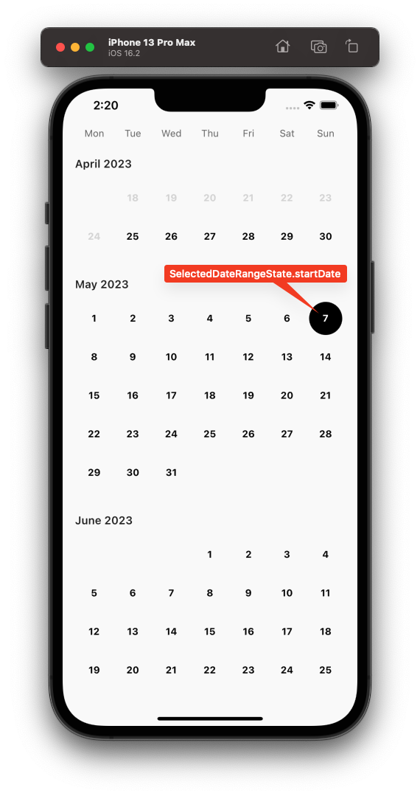
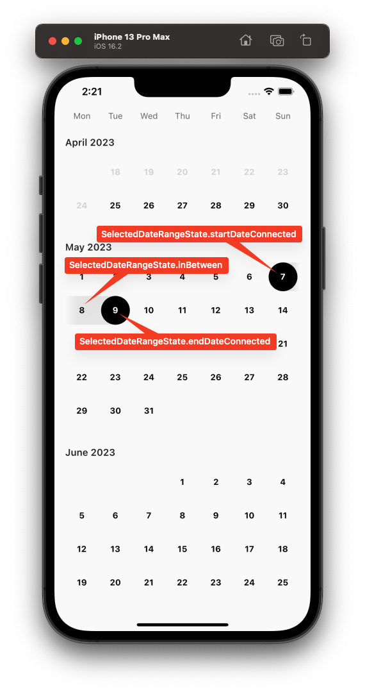

A collection of basic composable components for creating calendars.

[](https://github.com/pongloongyeat/calendar_components/actions/workflows/flutter.yaml)
[](https://pub.dev/packages/calendar_components)
[](https://opensource.org/licenses/MIT)

## Getting started
Add the following line to your `pubspec.yaml`

```yaml
calendar_components: ^0.1.0
```

## Available components

This package comes with some very simple components for you to build your own calendar.

These components expect you to handle the design and state by yourself. Having designed a few customised calendars myself, I've found it hard to follow a specific design and modifying it to fit my needs. Because of this, the components in this package only provide an item builder with certain useful parameters for you to construct your own widgets.

### `CalendarComponentHeader`

The header of a calendar. Typically shown at the top of the calendar.

```dart
CalendarComponentHeader(
  itemBuilder: (day) => Text(day.name),
)
```

### `CalendarComponentDayGrid`

The basic calendar grid. `CalendarComponentDayGrid` comes with two constructors for dealing with overflowing dates where extra dates have to be shown to ensure that the calendar grid is fully filled with 6 rows of 7 days. An example of overflow:


If constructed with no overflow, this removes the overflowed weeks where possible.

Referring to the example above:


Notice that the overflowed week at the bottom of April has been removed but the overflowed days remain at the top since removing the whole week would mean removing the 1st and 2nd days of the month, which is part of the current month and shouldn't be removed.

```dart
final currentMonth = DateTime.now();

CalendarComponentDayGrid.overflow(
  currentMonth: currentMonth,
  itemBuilder: (context, date, index) {
    return Text('${date.day}');
  },
)

// or

CalendarComponentDayGrid.noOverflow(
  currentMonth: currentMonth,
  startDate: currentMonth.copyWith(day: 1),
  endDate: currentMonth.lastDayOfCurrentMonth(),
  itemBuilder: (context, date, index) {
    return Text('${date.day}');
  },
);
```

### `CalendarComponentSingleSelectableDayGrid` and `CalendarComponentMultipleSelectableDayGrid`

A selectable day grid of a calendar which allows for the selection of one or more dates. This is a `StatelessWidget`. You should handle storing your selected date(s) by yourself.

An `isSelected` boolean is provided in the item builder to render your widget for selected and unselected states.

```dart
final currentMonth = DateTime.now();

CalendarComponentSingleSelectableDayGrid.overflow(
  selectedDate: ...,
  currentMonth: currentMonth,
  itemBuilder: (context, date, isSelected, index) {
    return GestureDetector(
      onTap: () => setState(() {
        // Do something
      }),
      child: Text('${date.day}'),
    );
  },
)

// or

CalendarComponentMultipleSelectableDayGrid.noOverflow(
  selectedDates: [...],
  currentMonth: currentMonth,
  startDate: currentMonth.copyWith(day: 1),
  endDate: currentMonth.lastDayOfCurrentMonth(),
  itemBuilder: (context, date, isSelected, index) {
    return GestureDetector(
      onTap: () => setState(() {
        // Do something
      }),
      child: Text('${date.day}'),
    );
  },
);
```

### `CalendarComponentRangedSelectableDayGrid`
A ranged selectable day grid of a calendar which allows for the selection of a range of dates. This is a `StatelessWidget`. You should handle storing your selected date range by yourself. An example is provided in the `example/` folder.

The item builder for this widget contains a `SelectedDateRangeState` passed in its builder.

A `SelectedDateRangeState` describes what state a selected date is in inside the `CalendarComponentRangedSelectableDayGrid` calendar grid

If this value is null, it means the item being built is not a selected item nor is it within a selected date range.

If only one date is chosen, this corresponds to an unconnected start date. Note that there cannot be an unconnected end date since it is unbounded at this point.



For a valid/bounded date range, it is possible to determine whether an item in the selected date range is a start date, end date or in between. Notice that the enum is called `startConnected` and `endConnected`. This is because the date range is now valid and you may want to render a joined selected item widget.



Additionally, there is also a `startDateIsEndDate` enum value to describe that the start and end dates are the same. This is exposed in case you want to render this as a valid date range.

Also included is an index that is passed in the item builder. This is typically useful for showing fade effects/gradients at the extreme ends of the calendar grid.

```dart
CalendarComponentRangedSelectableDayGrid.overflow(
  selectedStartDate: ...,
  selectedEndDate: ...,
  currentMonth: DateTime.now(),
  itemBuilder: (context, date, selectedState, index) {
    return GestureDetector(
      onTap: () => setState(() {
        // Do something
      }),
      child: Text('${date.day}'),
    );
  },
)
```
