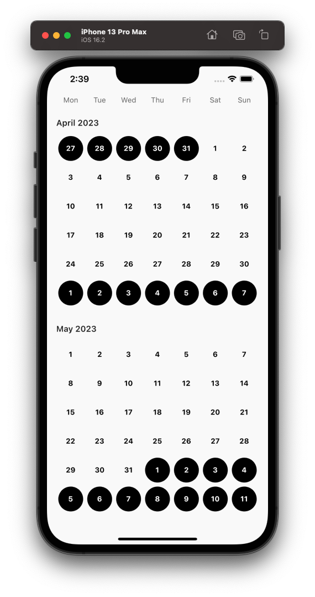
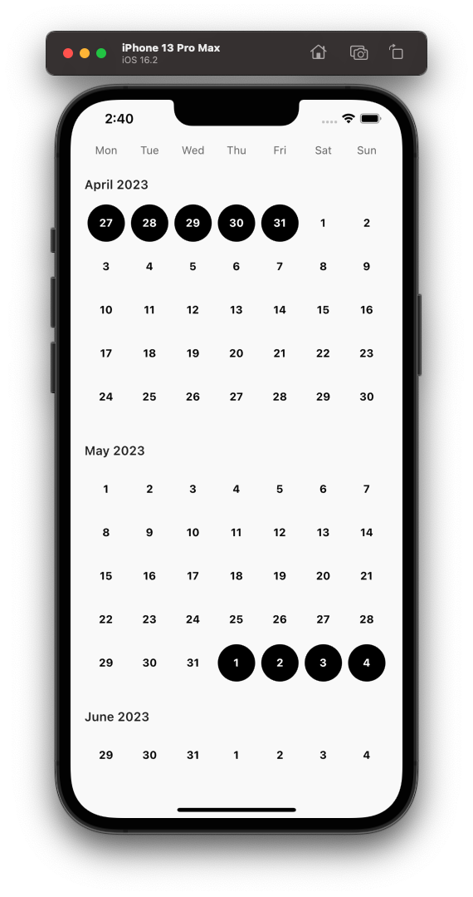

A collection of basic composable components for creating calendars.

## Getting started
Add the following line to your `pubspec.yaml`

```yaml
calendar_components: ^0.0.1
```

## Available components

This package comes with some very simple components for you to build your own calendar.

These components expect you to handle the design and state by yourself. Having designed a few customised calendars myself, I've found it hard to follow a specific design and modifying it to fit my needs. Because of this, the components in this package only provide an item builder with certain useful parameters for you to construct your own widgets.

### `CalendarComponentHeader`

The header of a calendar. Typically shown at the top of the calendar.

```dart
CalendarComponentHeader(
  itemBuilder: (day) => Text(day.name),
)
```

### `CalendarComponentDayGrid`

The basic calendar grid. `CalendarComponentDayGrid` comes with two constructors for dealing with overflowing dates where extra dates have to be shown to ensure that the calendar grid is fully filled with 6 rows of 7 days. An example of overflow:



If constructed with no overflow, this removes the overflowed weeks where possible.

Referring to the example above:



Notice that the overflowed week at the bottom of April has been removed but the overflowed days remain at the top since removing the whole week would mean removing the 1st and 2nd days of the month, which is part of the current month and shouldn't be removed.

```dart
final currentMonth = DateTime.now();

CalendarComponentDayGrid.overflow(
  currentMonth: currentMonth,
  itemBuilder: (context, date, index) {
    return Text('${date.day}');
  },
)

// or

CalendarComponentDayGrid.noOverflow(
  currentMonth: currentMonth,
  startDate: currentMonth.copyWith(day: 1),
  endDate: currentMonth.lastDayOfCurrentMonth(),
  itemBuilder: (context, date, index) {
    return Text('${date.day}');
  },
);
```

### `CalendarComponentSingleSelectableDayGrid` and `CalendarComponentMultipleSelectableDayGrid`

A selectable day grid of a calendar which allows for the selection of one or more dates. This is a `StatelessWidget`. You should handle storing your selected date(s) by yourself.

An `isSelected` boolean is provided in the item builder to render your widget for selected and unselected states.

```dart
final currentMonth = DateTime.now();

CalendarComponentSingleSelectableDayGrid.overflow(
  selectedDate: ...,
  currentMonth: currentMonth,
  itemBuilder: (context, date, isSelected) {
    return GestureDetector(
      onTap: () => setState(() {
        // Do something
      }),
      child: Text('${date.day}'),
    );
  },
)

// or

CalendarComponentMultipleSelectableDayGrid.noOverflow(
  selectedDates: [...],
  currentMonth: currentMonth,
  startDate: currentMonth.copyWith(day: 1),
  endDate: currentMonth.lastDayOfCurrentMonth(),
  itemBuilder: (context, date, isSelected) {
    return GestureDetector(
      onTap: () => setState(() {
        // Do something
      }),
      child: Text('${date.day}'),
    );
  },
);
```

### `CalendarComponentRangedSelectableDayGrid`
A ranged selectable day grid of a calendar which allows for the selection of a range of dates. This is a `StatelessWidget`. You should handle storing your selected date range by yourself. An example is provided in the `example/` folder.

The item builder for this widget contains two _connection_ enum parameters passed in its builder:
- `RangedDateConnection` and
- `InBetweenConnection`

A `RangedDateConnection` describes which end of the connected date in the grid an item is connected to. For example,


If only one date is chosen, this corresponds to an unconnected end.
Referring to the example above,


An `InBetweenConnection` describes the state of an item in between two dates at either end of the grid. For example,


This is typically useful for showing fade effects/gradients at the extreme ends of the calendar grid.

```dart
CalendarComponentRangedSelectableDayGrid.overflow(
  selectedDate: ...,
  currentMonth: DateTime.now(),
  itemBuilder: (context, date, selectedDateConnection, inBetweenConnection) {
    return GestureDetector(
      onTap: () => setState(() {
        // Do something
      }),
      child: Text('${date.day}'),
    );
  },
)
```
